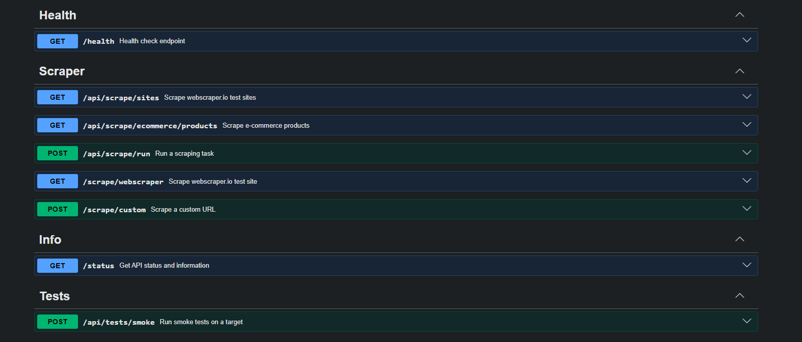

# Playwright with Node.js

Production-oriented API for scraping demo pages with Playwright, Express, TypeScript, and Swagger/OpenAPI documentation.

[](https://railway.com/deploy/playwright-with-nodejs?referralCode=asepsp&utm_medium=integration&utm_source=template&utm_campaign=generic)



## Features

- Express API with route, controller, service, middleware, and utility layers
- Playwright Chromium scraping through a shared browser service
- Swagger UI at `/docs` and OpenAPI JSON at `/openapi.json`
- Zod request validation, Helmet, CORS, compression, and rate limiting
- Winston structured logging
- Jest unit tests and Playwright API/e2e tests
- Docker image with Playwright browser dependency installation

## Requirements

- Node.js 20+
- npm
- Docker, optional for container deployment

## Quick Start

```bash
npm install
cp .env.example .env
npm run dev
```

The API runs on `http://localhost:3000` by default.

Useful URLs:

- Root: `http://localhost:3000/` redirects to `/docs`
- Health: `http://localhost:3000/health`
- Swagger UI: `http://localhost:3000/docs`
- OpenAPI JSON: `http://localhost:3000/openapi.json`

## Scripts

```bash
npm run dev            # Start TypeScript dev server
npm run build          # Compile src/ to dist/
npm start              # Run compiled app
npm run typecheck      # TypeScript check without emit
npm run lint           # ESLint
npm run format:check   # Prettier check
npm test               # Jest tests
npm run test:e2e       # Playwright API/e2e tests
npm run docker:build   # Build Docker image
npm run docker:compose # Start with Docker Compose
npm run zip            # Build and create distribution zip
```

## API Endpoints

### Root

```http
GET /
```

Redirects to `/docs`.

### Health

```http
GET /health
```

Returns service health, uptime, environment, and timestamp.

### Scrape Test Sites

```http
GET /api/scrape/sites
```

Scrapes available test site links from `SCRAPER_BASE_URL`.

### Scrape E-commerce Products

```http
GET /api/scrape/ecommerce/products?limit=10
```

Query parameters:

- `limit`: integer from 1 to 50, default `10`

### Run Scrape Task

```http
POST /api/scrape/run
Content-Type: application/json

{
  "target": "ecommerce",
  "limit": 10
}
```

Supported targets:

- `test-sites`
- `ecommerce`

### Run Smoke Test

```http
POST /api/tests/smoke
Content-Type: application/json

{
  "target": "test-sites"
}
```

## Response Format

Success responses:

```json
{
  "success": true,
  "data": {},
  "meta": {
    "durationMs": 123,
    "timestamp": "2026-05-07T00:00:00.000Z"
  }
}
```

Error responses:

```json
{
  "success": false,
  "error": "Error message",
  "meta": {
    "durationMs": 12,
    "timestamp": "2026-05-07T00:00:00.000Z"
  }
}
```

## Project Structure

```text
playwright-with-nodejs/
|-- src/
|   |-- app.ts
|   |-- index.ts
|   |-- server.ts
|   |-- scraper.ts
|   |-- scraper.test.ts
|   |-- config/
|   |-- controllers/
|   |-- middlewares/
|   |-- routes/
|   |-- schemas/
|   |-- services/
|   |-- types/
|   `-- utils/
|-- tests/
|   `-- e2e/
|-- docker/
|   `-- entrypoint.sh
|-- Dockerfile
|-- docker-compose.yml
|-- jest.config.js
|-- playwright.config.ts
|-- package.json
|-- tsconfig.json
`-- README.md
```

`dist/`, `coverage/`, `test-results/`, and `playwright-report/` are generated outputs.

## Environment Variables

| Variable                | Default                                                | Description                                                 |
| ----------------------- | ------------------------------------------------------ | ----------------------------------------------------------- |
| `NODE_ENV`              | `development`                                          | Runtime environment: `development`, `production`, or `test` |
| `PORT`                  | `3000`                                                 | HTTP port                                                   |
| `HOST`                  | `0.0.0.0`                                              | Bind host                                                   |
| `LOG_LEVEL`             | `info`                                                 | Winston log level                                           |
| `CORS_ORIGIN`           | `*`                                                    | Allowed CORS origin, comma-separated for multiple origins   |
| `SCRAPER_BASE_URL`      | `https://webscraper.io/test-sites`                     | Test site source URL                                        |
| `SCRAPER_ECOMMERCE_URL` | `https://webscraper.io/test-sites/e-commerce/allinone` | E-commerce source URL                                       |
| `PLAYWRIGHT_HEADLESS`   | `true`                                                 | Browser headless mode                                       |
| `PLAYWRIGHT_TIMEOUT_MS` | `30000`                                                | Playwright page/navigation timeout                          |
| `SCRAPER_MAX_LIMIT`     | `50`                                                   | Maximum scrape limit used by configuration                  |
| `RATE_LIMIT_WINDOW_MS`  | `60000`                                                | Rate limit window                                           |
| `RATE_LIMIT_MAX`        | `60`                                                   | Max requests per rate limit window                          |

## Docker

Build and run:

```bash
npm run docker:build
docker run -p 3000:3000 --env-file .env playwright-api:latest
```

Or use Compose:

```bash
npm run docker:compose
```

The Dockerfile uses Debian slim instead of Alpine so Playwright can install Chromium and OS dependencies more reliably. If `package-lock.json` exists, Docker uses `npm ci`; otherwise it falls back to `npm install`. For repeatable production builds, generate and commit `package-lock.json`.

## Production Checklist

- Set `NODE_ENV=production`
- Configure `CORS_ORIGIN` instead of using `*`
- Use `LOG_LEVEL=warn` or `error`
- Commit `package-lock.json` for deterministic installs
- Send logs to external storage in production
- Put the service behind HTTPS/reverse proxy
- Set CPU and memory limits for the container
- Monitor `/health`
- Validate target sites are reachable from the deployment environment

## Notes

- Scraping and e2e tests depend on external network access to `webscraper.io`.
- Swagger uses a relative OpenAPI server URL (`/`) so the "Try it out" button calls the same origin used to open `/docs`.
- Endpoint-level `headless` values are accepted by current schemas for compatibility, but browser mode is controlled by `PLAYWRIGHT_HEADLESS`.
- `src/scraper.ts` is a legacy standalone scraper used by Jest tests; the main API uses the service/controller stack under `src/services` and `src/controllers`.

## License

MIT
